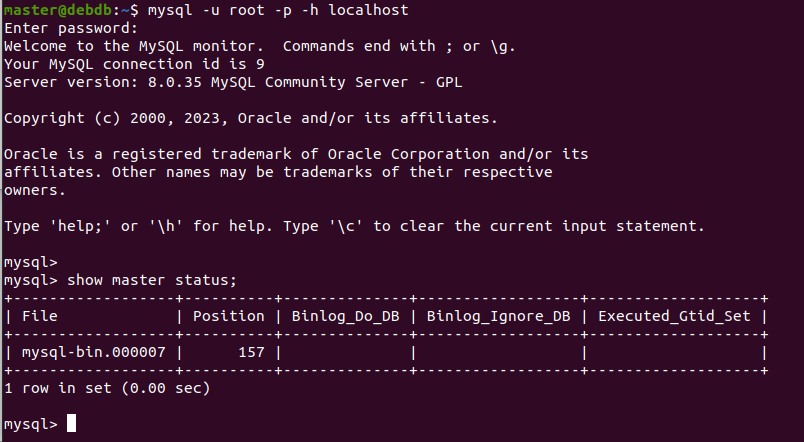

# Домашнее задание к занятию "`Репликация и масштабирование. Часть 1`" - `Аблогин Павел`

---

### Задание 1

`Отличия режимов репликации master-slave и master-master`

1. `При использовании режима master-slave все изменения данных происходят на одном сервере (master). Такой сервер может быть только один. Данные с master копируются на вспомогательные серверы (slave) откуда в дальнейшем они могут быть прочитаны. Данные могут быть прочитаны с любого из серверов (master или slave).`
2. `В режиме master-master все серверы являются одновременно и master и slave, т.е. и запись и чтение данных производятся на всех серварах, а изменения копируются между серверами.`

---

### Задание 2

`Выполнил конфигурацию master-slave репликации на двух виртуальных машинах.`

`Скриншоты выполнения задания 2`

---
